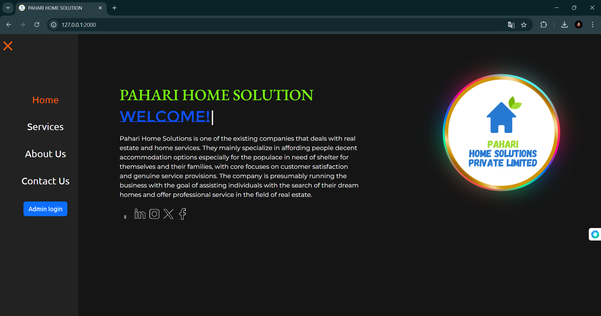
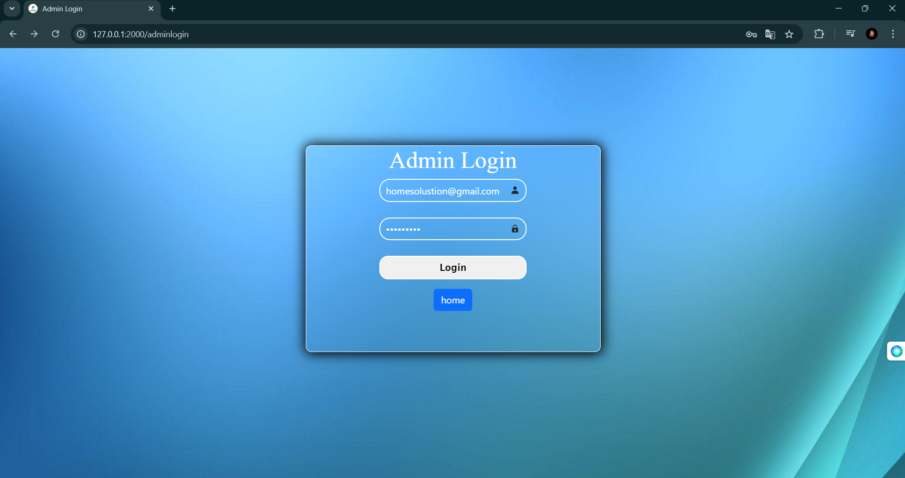
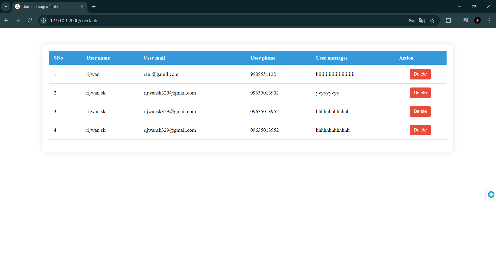

## Web Development Practical Task for PAHARI HOME SOLUTIONS PVT. LTD.

## HTML , CSS , JavaSvript , python(flask), bootstrap , flask-sqlalchemy, jinja2 .

## Frist active the env "pahari_home_solution" then run app.py 
## if youn want to use admin login you should paharihomesolustion@gmail.com this main and pahari123 this password. If you login admin page you see the all user submit massage.

## Live site:

